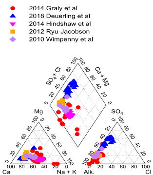
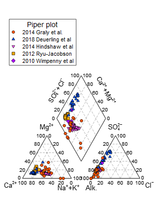

# Piper diagrams using Gnuplot or Veusz #

**Piper** diagrams are used by geochemists to describe and clasify natural groundwaters, see for example [Wikipedia][1]. 

 [1]: https://en.wikipedia.org/wiki/Piper_diagram

A Piper diagram consists of two [ternary][2] plots and a central diamond plot. They can be plotted on [Cartesian coordinates][3] as described in:

- Peeters, L. (2014). A background color scheme for Piper plots to spatially visualize hydrochemical patterns. [Groundwater Vol.52, pp.2–6.][4]

 [2]: https://en.wikipedia.org/wiki/Ternary_plot
 [3]: https://en.wikipedia.org/wiki/Cartesian_coordinate_system
 [4]: https://doi.org/10.1111/gwat.12118

Many computer programs allow plotting data in Cartesian coordinades. Two such open-source programs are **Gnuplot** ([Wikipedia][5], [official website][6]) and **Veusz** ([Wikipedia][7], [official website][8]). Files needed to plot Piper diagrams using either Gnuplot or Veusz are available here. They have been made for Gnuplot version 5.2 and Veusz version 3.0.1.

 [5]: https://en.wikipedia.org/wiki/Gnuplot
 [6]: http://www.gnuplot.info/
 [7]: https://en.wikipedia.org/wiki/Veusz
 [8]: https://veusz.github.io

## Download ##
See the [releases section][9].

## Get going ##
The zip-file contains two folders, one for Gnuplot and the other for Veusz. For each program there are input text files to draw the axes and the grids (both files are equal for the two programs). An example data file is also included with several sets of chemical compositions of natural waters (this input text file is also equal for both programs).

 [9]: https://github.com/ignasi-p/eq-diagr/releases/latest

- **Gnuplot:**  The script `Piper.gpl` is used to create the Piper diagram by using the command "load". This is a text file. Before using it, you must change the line: `wf = 'C:\Piper\Gnuplot'` (at the beginning of the script) so that it points to your working folder. At the beginning of the script there is section named `#--- Graphic output`; uncomment the two lines indicated to generate a SVG-file (instead of displaying the diagram in a screen window). You may easily change the axes labels, for example add electric charges as in: `set label 41 "Ca^{2+}"...`; or move labels around, etc, but be aware that the SVG output is not exactly equivalent to what you will see on the screen.

- **Veusz:**  The Veuz file (`Piper-Veusz.vsz`) is used with the menu "File / Open".  This is a text file.  Before using it you will need to change the following line: `AddImportPath(u'C:\\Piper\\Veusz')` (at the top of the file) so that it points to the location of your working folder.  In the menu "Edit / Custom definitions" of Veusz check that the variable "xOffset" is defined, otherwise load the file `Offset.vsz`.

The files for both programs have been prepared to create text labels large enough for diagrams 7x8 cm in size.

## Input data ##

- The input data file `Piper-data.csv` is a
  text file where data are separated by
  semicolons (;). You may change this in
  both Gnuplot and Veusz.

- Comments start with the symbol "#". You may
  change this in both Gnuplot and Veusz.

- Each row contains a water sample: the name
  of the sample, followed by the concentrations
  of Ca, Mg, Na, K, HCO3 (alkalinity), Cl and
  SO4. All concentrations must be in mol/L.
  However, you may use milli mol/L or
  micro mol/L as long as all the values
  for a given water sample (that is, for
  a given row in the data file) have equal units.

- Groups of data:
    - in Gnuplot water samples are separated
      into groups by introducing two empty
      lines. The "plot" command in Gnuplot
      uses the "index" option to select a
      group of data (starting at index zero).
      The first row of each group contains
      its name in column one; this name is
      used in the key (legend). An alternative
      would be to use a different input file
      for each group of data, but the provided
      script uses a single input data file.

    - In Veusz data may be divided into
      groups by adding new x-y plots (menu
      "Insert / Add xy" when the Piper
      diagram widget is selected) and
      then defining the plotted interval
      for the X and Y data, in the format
      `x_cat[37:112]` (starting with zero).
      An alternative would be to use a
      different input file for each group
      of data, but the provided Veusz file
      uses a single input data file.

      Three x-y plots are needed for each
      group of data: a left ternary plot,
      using the calculated "x_cat" and "y_cat"
      values, the right ternary plot, using the
      "x_an" and "y_an" values, and the diamond
      plot, using the "x_d" and "y_d" values.
      If you add data, or change it, you must
      manually modify the data ranges in each
      of the three x-y plots, as indicated in
      the example Veusz file. You must also
      select (for each of these three plots)
      the same marker and color, as indicated
      in the provided Veusz file. The key text
      for each group of data, displayed in the
      legend, is entered (manually) only for
      the left ternary plot, see the provided
      Veusz file.
      

- First row:
    - in Gnuplot the first row of each data
      group contains the name of the group in
      column one. The contents of the following
      columns in that row are not used.
      In the following rows, column one contains
      the name of each sample (not used).

    - Veusz will use a name above a column
      to specify what the dataset name should be.
      In the provided Veusz file, the first
      non-comment row of the data file must
      contain: any text (the name of the
      first data group), followed by the texts:
      `Ca_mol/L;` `Mg_mol/L;` `Na_mol/L;` `K_mol/L;`
      `HCO3_mol/L;` `Cl_mol/L;` `SO4_mol/L`
      (the delimiter is ";" but it may
      be changed in the Veusz file).
      The dataset-names `Ca_mol/L` etc are
      hard-wired in defined functions in the
      provided Veusz file (`Piper-Veusz.vsz`).
      You may if you wish add a name for each
      group of data in column one of the first
      row of that group of data, as long as the
      rest of the line is empty (as in the
      provided data file `Piper-data.csv`).
      If you add additional texts in the
      following columns, for example:

      `Smith et al 1980; all data in mmol/L`

      the provided Veusz file (`Piper-Veusz.vsz`)
      in such a case will not work.

## Output ##

Publication-quality output is obtained with SVG files, which may later be edited using **Inkscape** ([Wikipedia][10], [official website][11]).  The two output files generated by the provided Gnuplot script and the Veusz file are seen below, at the top and bottom, respectively.

 [10]: https://en.wikipedia.org/wiki/Inkscape
 [11]: https://inkscape.org/

## Axes and grids ##

The axes and grids are plotted in the Cartesian
coordinates, similarly to the description provided
[here][12]. The width of the ternary plots is 1
(corresponding to 100 %), and the spacing between
the two ternary plots is 0.4, so that the left
bottom edge of the ternary plot on the right is
at 1.4 (this is the variable `xOffset`) and its
right edge is at 2.4. The coordinates of the
axes and grids, stored in files `Piper-axes.csv`
and `Piper-grid.csv` have been calculated based
on this.  The "tick" labels and axes labels
are calculated and placed in the Piper diagram
when it is being drawn.

[12]: https://staff.aist.go.jp/a.noda/programs/ternary/ternary-en.html
